# Software Engineering note

## Software configuration management(SCM)

- Four aspects
  - Change control 
  - Version control 
  - Building
  - Releasing
- Supported by tools
- Requires expertise and oversight 
- More important on large projects


## Extreme Programming

**Waterfall model**

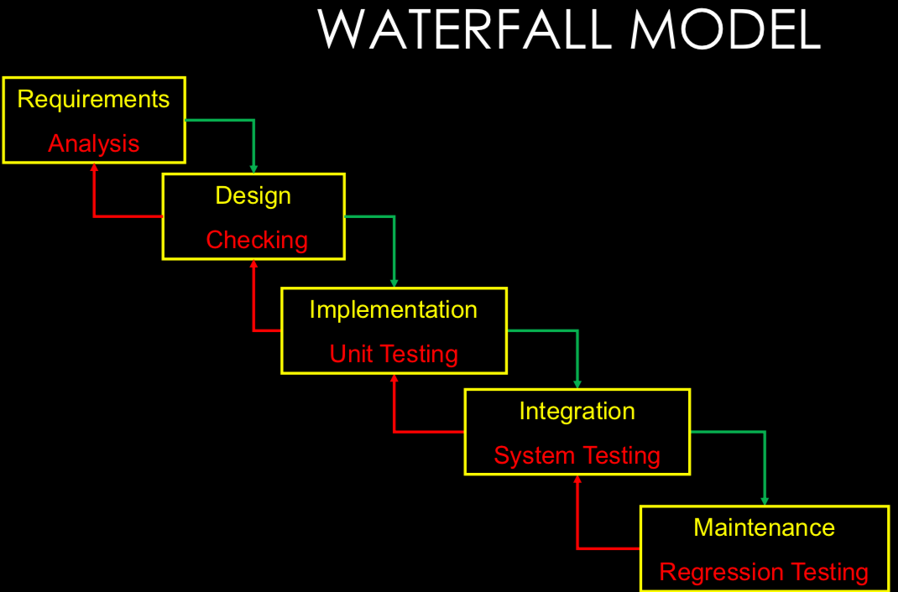


### Extreme Programming

对比rigid waterfall process是一个collaborative and iterative design process

**Main ideas**

- Don't write much documentation
  - Working code and tests are the main written product
- Implement features one by one
- Release code frequently
- Work closely with the customer
- Communicate a lot with team members


**Key practices**

- Planning game for requirements
- Test-driven development for design and testing
- Refactoring for design
- Pair programming for development
- Continuous integration for integration


XP is an iterative process

- Iteration = two week cycle (1-3 weeks) 
- Iteration is going to implement set of **user stories** 
  - User story: a feature customers want in the software
  - the smallest amount of information necessary to allow the customer to define a path through the system
- Divide work into tasks small enough to finish in a day 


### Pair programming

- Two programmers work side-by-side at one computer, continuously collaborating on the same design, algorithm, code, and test.
- Periodically switch roles of driver and navigator (<=30min)


### Concepts:

- Story point: unit of measure for expressing the overall size of a user story, feature, or other piece of work. The raw value of a story point is unimportant. What matters are the relative values. 
  - Related to how hard it is and how much of it there is
  - Not related to amount of time or the number of people 
  - Unitless, but numerically-meaningful 

- Ideal time: the amount of time “something” takes when stripped of all peripheral activities 
  - Example: American football game = 60 minutes 

- Elapsed time: the amount of time that passes on the clock to do “something”
  - Example: American football game = 3 hours 

- Velocity: measure of a team’s rate of progress 


### Planning

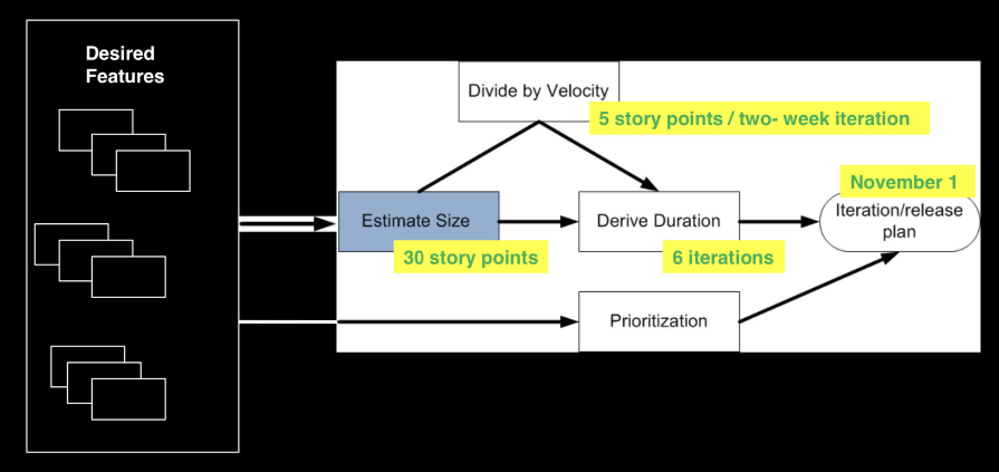

Programmers only worry about one iteration at a time

- Simplicity: add one feature at a time

### Test

Run program with known inputs, check results


术语区别

Fault: defect, bug

Failure: program behaves unexpectedly during testing

Error: difference between "computed, observed, or measured value or condition" and "true, specified, or theoretically correct value or condition" (**Error causes failure**)


##### ASSERTION PATTERNS

State Testing Patterns

- Final State Assertion
  - Most Common Pattern: Arrange. Act. Assert.
- Guard Assertion
  - Assert Both Before and After The Action (Precondition Testing)
- Delta Assertion
  - Verify a Relative Change to the State
- Custom Assertion
  - Encodes Complex Verification Rules


##### PARAMETERIZED TESTS

Parameterized tests需要独占一个测试类

@Parameters


##### Theories

@Theory

@DataPoints


#### Test Driven Development

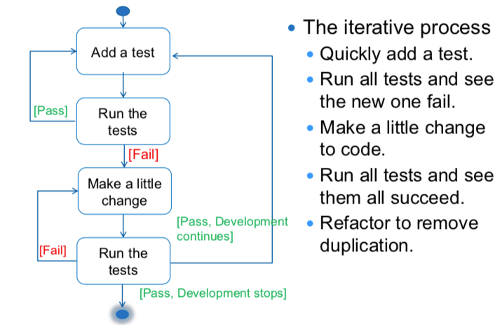

#### Some tips in test

1. Each test should be independent of each other
2. Any given behaviour should be specified in one and only one test.
3. Correct method signature should be assertEquals(expected,actual)


#### Code Coverage

Code coverage is a measure used to describe the degree to which the source code of a program is executed when a particular test suite runs

- White box testing
- a measure of test quality


#### Mutation Testing

Code coverage cannot ensure test quality=>solution: Mutation Testing


## MEASURING SIZE OF SYSTEM

- Lines of code (Source Lines of Code - SLOC)

- Number of classes, functions, files, etc.

- Function Points

### Measure complexity

- Cyclomatic complexity (Thomas J. McCabe, Sr. in 1976)

> A measure of logical complexity
>
> Tells how many tests are needed to execute every statement of program
>
> ```
> =Number of branches (if, while, for) + 1
> ```
>
> **Test view**
>
> Cyclomatic complexity is the **number of independent paths** through the procedure
>
> Gives an **upper bound on the number of tests** necessary to execute every edge of control graph
>
> **Metrics view**
>
> McCabe found that modules with cyclomatic complexity greater than 10 were hard to test and error prone


- Function points

- Coupling and cohesion

- Many OO-specific metrics (may cover later)


### Measure coupling

**DHAMA’S COUPLING METRIC**

```
ßßModule coupling = 1 / (
 number of input parameters + 
 number of output parameters + 
 number of global variables used + 
 number of modules called + 
 number of modules calling 
) 
```

0.5 is low coupling, 0.001 is high coupling 

**Ca** : Afferent coupling: the number of classes **outside** this module that depend on classes inside this module

**Ce** : Efferent coupling: the number of classes **inside** this module that depend on classes outside this module (Measure interrelationships between classes, 越大越不稳定)

```
Instability = Ce / (Ca + Ce)
```

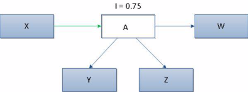


```
Abstractness = number of abstract classes in module / number of classes in module
```

Abstractness越大，Instability越低


### List of OO metrics

- Weighted Methods Per Class (WMC)

  - WMC for a class is the sum of the complexities of the methods in the class
  - **Possible method complexities** 
    - 1 (number of methods)
    - Lines of code
    - Number of method calls
    - Cyclomatic complexity


- Depth of Inheritance Tree (DIT)

  - Maximum length from a class to the root of the tree
  - eg: DIT=4
  - 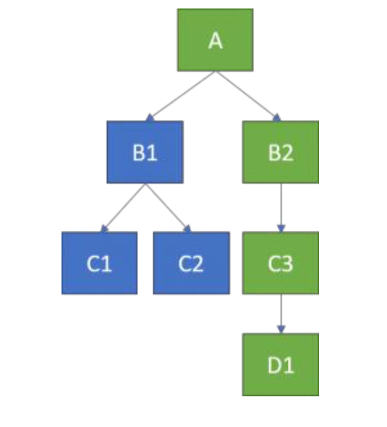
  - The deeper a class is in the hierarchy:
    - the more methods it inherits and so it is harder to predict its behavior
    - the more methods it reuses, Deeper trees are more complex


- Number of Children (NOC)

  - Number of immediate subclasses
  - More children is more reuse

- Coupling between Object Classes (CBO)

  - Number of other classes to which a class is coupled 

- Response for a Class (RFC)

  - Number of methods in a class or called by a class

- Lack of Cohesion in Methods (LCOM)

  - 下式针对**pairs of methods**的数量

  - \# pair of methods that share instances 减 \# … don't share …

```
= #don't_share_instance - #shared_instance
```


## Reverse Engineering

Discovering design of an artifact, from lower level to higher level.

#### Activities

- Read documentation • Talk to people

- Look at the code

- Work with the system • Write documentation


#### Read All Code in 1 Hour

- Intent: assess a software system via a brief but intensive code review
- Problem: system is large/varied, unfamiliar
- Solution: read code & document findings (important entities, “code smells”, tests)
- Hints: what to look for?
  - Coding styles/idioms, tests (system and unit)
  - Abstract classes or classes high in hierarchy
  - Large entities, comments

## Test

- Dynamic Analysis
- Static Analysis: 
  - 无需运行程序，用于发现早期bug
  - is done after coding and before executing unit tests
  - Tools: Checkstyle, PMD, FindBugs

### Types

- Smoke test (build verification test)
  - 冒烟测试是指对提交测试的软件在进行详细深入的测试之前而进行的预测试，这种预测试的主要目的是暴露导致软件需重新发布的基本功能失效等严重问题。冒烟测试可以由开发人员执行，也可以由测试人员来执行。即，在版本编译后正式提交测试之前由开发人员执行；或开发发布版本后，测试人员在接受这个版本作为正式版本进一步测试前执行。
- Unit test
  - 单元测试又称为模块测试，是针对程序模块（软件设计的最小单位）来进行正确性检验的测试工作。**程序单元**是应用的最小可测试部件。在过程化编程中，一个单元就是单个程序、函数、过程等；对于面向对象编程，最小单元就是方法，包括基类（超类）、抽象类、或者派生类（子类）中的方法。
- Regression test
  - 指修改了旧代码后，重新进行测试以确认修改没有引入新的错误或导致其他代码产生错误。


### Junit

1. 测试类的命名

测试类的命名规则是：被测试类的类名+Test

比如有一个类叫IrgSrhDelegate，那么它的测试类的命名就是IrgSrhDelegateTest

2. 测试用例的命名

测试用例的命名规则是：test+用例方法名称

比如要测试的方法叫updateData，那么测试用例的命名就是testUpdateData

3. 测试包名的命名

test.原包名（eg: test.com.wistrons.util)

#### 

**assert(expected_val, test_val)**


### Defensive Programming:

Making sure that no warning produced by Static Analysis is a form of defensive programming

- Redundant code(多余代码) is incorporated to check system state after modifications. 
- Implicit assumptions (隐式假设) are tested explicitly. 
- Risky programming constructs are avoided. 
  - Pointers
  - Dynamic memory allocation
  - Floating-point numbers
  - Parallelism
  - Recursion
  - Interrupts


### Maintenance

#### Fault Tolerance


### Security

Authentication: establishes the identity of an agent

Authorization: establishes what an authenticated agent may do


### Levels of Software Testing

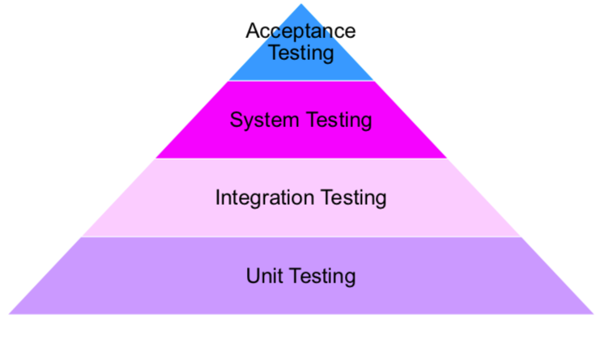

- Unit Test
  - Test individual units of a software
  - A unit: smallest testable part of an application
    - Eg: method
- Integration testing:
  - Verify software quality by testing two or more dependent software modules as a group.
- Big-bang Integration Testing
  - All component are integrated together at once
  - 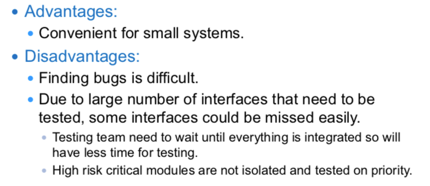
- Incremental Integration Testing
  - Develop a functional "skeleton" system, Design, code, test, debug a small new piece, Integrate this piece with the skeleton
  - 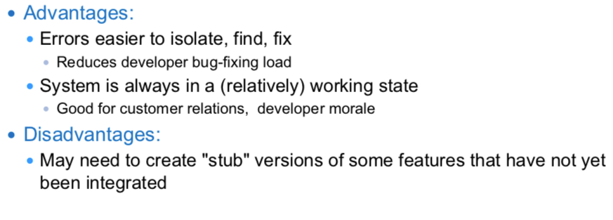

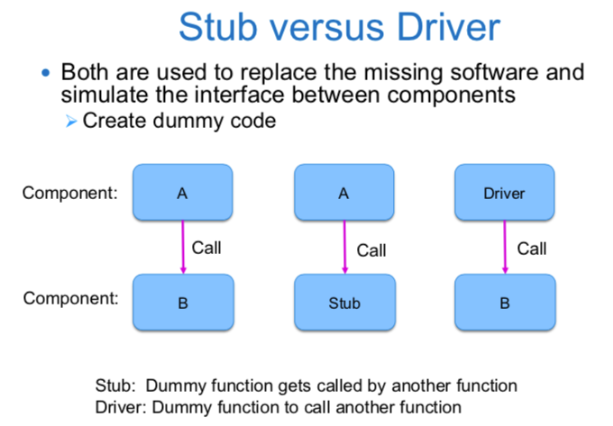


### Regression Test

re-running functional and non-functional tests to ensure that previously developed and tested software still performs after a change.

回归测试确保系统的一部分中的新代码不会在整个系统中引起不必要的副作用。


### Flaky Tests

Test which could **fail** or **pass** for the same code

Reasons:

- Concurrency
- Environment/setup problems
- Non-deterministic or undefined behaviors


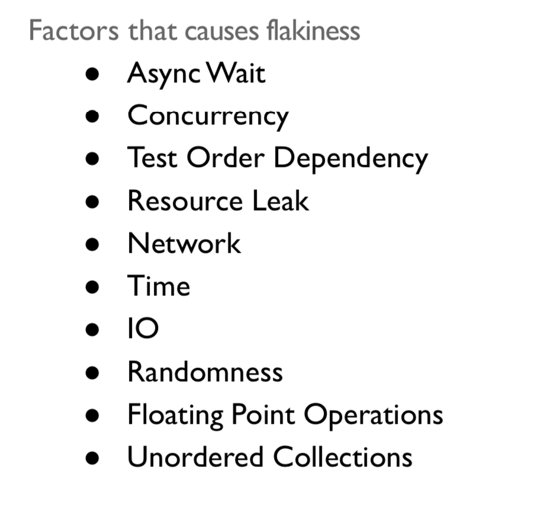


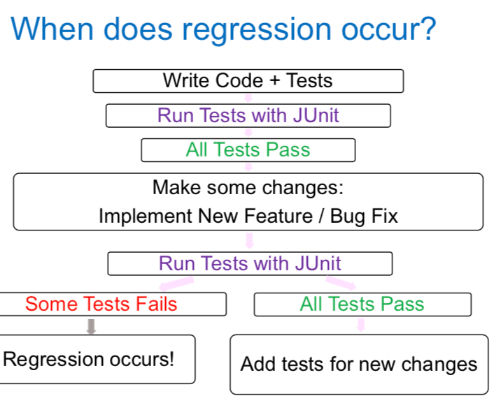

#### Regression Test Selection(RTS)

No need to Retest all

this technique runs a part of the test suite (owing to the cost of retest all) if the cost of selecting the part of the test suite is less than the Retest all technique.

## System reuse

### Types of reuse: 

- Application System reuse 
- Components reuse 
- Function reuse 

### Benefits of reuse

- Increased reliability 
- Reduced process risk 
- Effective use of specialists 
- Standard compliance 
- Accelerate development 

### Problems of reuse

- Increased maintenance cost 
- Lack of tool support 
- Pervasiveness(普遍的) of "not invented here" syndrome (综合症)
- Need to create and maintain a component library 
- Finding and adapting reusable components 


### Generator-Based Reuse

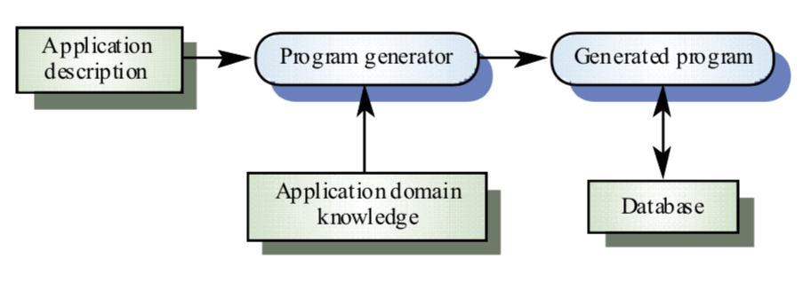

#### Advantages 

- Cost effective 
- Easier for end-users to develop programs using generators than other CBSE techniques 

#### Disadvantages 

- Limited to small number of application domains 


### Component-Based Software Engineering

#### CBSE VS OOSE 

- CBSE relies on reuse 
- CBSE emerge from the failure of OOSE to support reuse effectively 
- Objects (classes) are too specific to reuse 
- Components are more abstract than classes (stand-alone service providers) 

###  Commercial Off-the-shelf (COTS) components

usually complete applications library the off
an applications programming interface (API)

#### COTS integration problems

- Lack of developer control over functionality and performance 
- Problems with component interoperability as COTS vendors make different user assumptions
- COTS vendors may not offer users any control over the evolutions of its components
- COTS vendors may not offer support over the lifetime of a product 


### Abstraction in SE

- Procedural Abstraction 
  - Naming a sequence of instructions 
  - Parameterizing a procedure 
- Data abstraction 
  - Naming a collection of data 
  - Data type defined by a set of procedures 
- Control abstraction 
  - W/o specifying all register/binary-level steps 
- Performance Abstraction 
  - O(N)… 

#### How to get abstractions

- Get from someone else 
- Generalize from examples 
- Look for duplications and eliminate them 


### Architecture

**Example:**

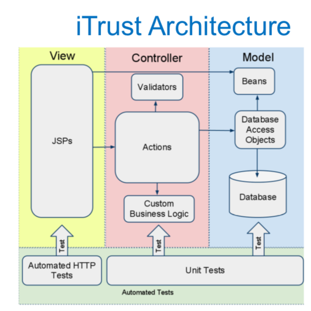

### Modularity

#### Advantage:

- Information hiding(high cohesion, low coupling)
- Work in parallel 
- Security - compartmentalization 
- Reliability - localization of failure 
- Parallelism - load balance processes 
- Distributed programming - design modules to reduce communication 


## UI design

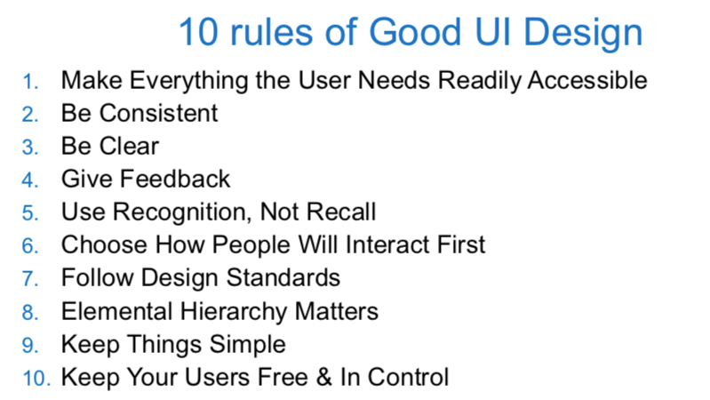


## Comment&Documentation

### Javadoc

Javadoc comments should be written for **programmers who want to use your code**

**Requirement:**

- Javadoc comments should describe exactly how to use the class, method, constructor 
- Javadoc comments should not describe the internal workings of the class or method (unless it affects the user in some way) 
- javadoc method comments should not tell who uses the method 


#### Tags

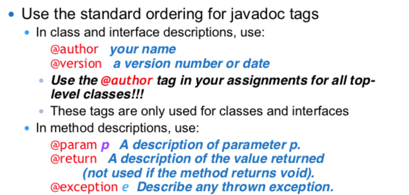

@throws以前使用的是@exception, 二者等价


#### Rules for writing summaries

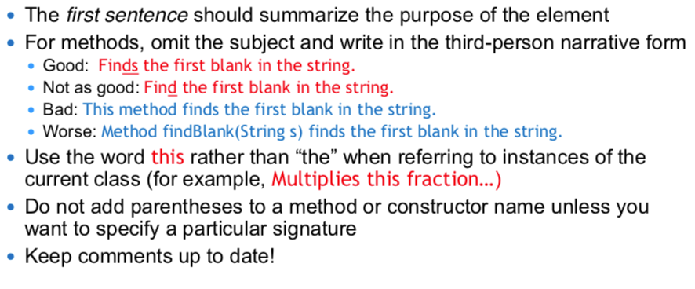


## Devops&CI

**Devops:**

Development+ IT Operations(IT运维技术人员)


### Continuous Integration(CI)

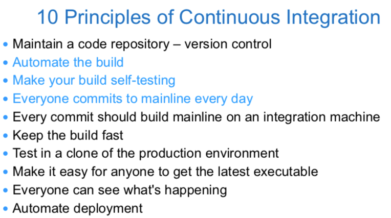

#### Automate the build

**Daily build**: Compile working executable on a daily basis

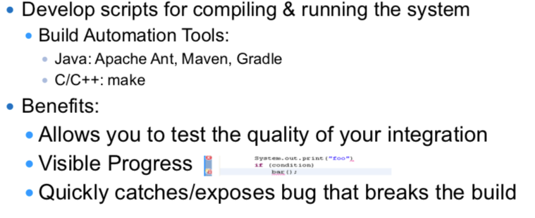


#### Make your build self-testing

**Automated tests**: Tests that can be run from the command line


#### Daily Commits

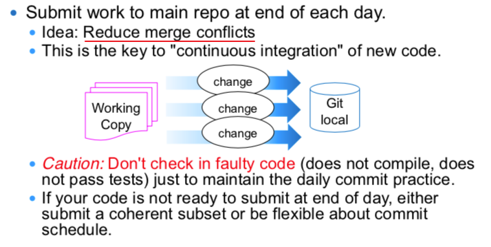

#### CI Server

An external machine that automatically pulls your latest repo code and fully builds all resources.

- If anything fails, contacts your team (e.g. by email).
- Ensures that the build is never broken for long.


#### Continuous Integration持续集成 &  Continuous Delivery持续交付 & Continuous Deployment持续部署

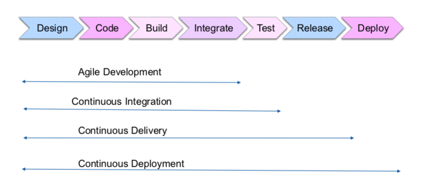

##### Continuous Delivery

- Continous Delivery=CI+ automated test suite
- Not every change is a release
  - Manual trigger
  - Trigger on a key file (version)
  - Tag releases!

##### Continuous Deployment

Continuous Deployment=CD+ automatic deployment


## Security Engineering

**Definition:**

Tools, techniques and methods to support the development and maintenance of systems that can resist malicious attacks that are intended to damage a computer-based system or its data.


### Security Dimensions

- Confidentiality
  - Information in a system may be disclosed or made accessible to people or programs that are not authorized to have access to that information. 
- Integrity
  - Information in a system may be damaged or corrupted making it unusual or unreliable.
- Availabilty
  - Access to a system or its data that is normally available may not be possible.


### Security Levels

- Infrastructure security(not focus on this class)
  - concerned with maintaining the security of all systems and networks that provide an infrastructure and a set of shared services to the organization.
  - a **systems management** problem where the infrastructure is **configured** to resist attacks
- Application security
  - concerned with the security of individual application systems or related groups of systems.
  - a **software engineering** problem where the system is **designed** to resist attacks.
- Operational security
  - concerned with the secure operation and use of the organization’s systems.


### System security management

- User and permission management
  - Adding and removing users from the system and setting up appropriate permissions for users
- Software deployment and maintenance
  - Installing application software and middleware and configuring these systems so that vulnerabilities are avoided.
- Attack monitoring, detection and recovery
  - Monitoring the system for unauthorized access, design strategies for resisting attacks and develop backup and recovery strategies.


### Security terminology

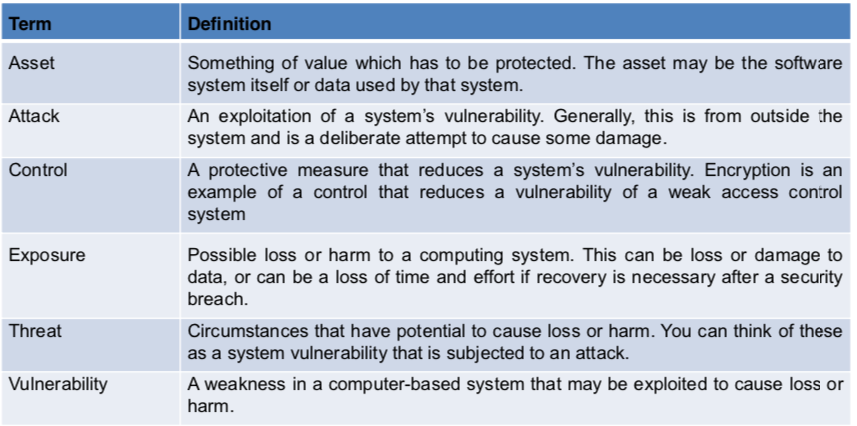

#### Examples:

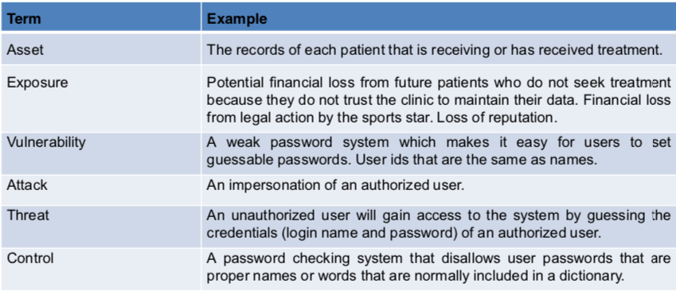


### Thread type

- Interception(窃听) threats that allow an attacker to gain access to an asset
- Interruption threats that allow an attacker to make part of the system unavailable
- Modification threats that allow an attacker to tamper(篡改) with a system asset.
- Fabrication(伪造) threats that allow an attacker to insert false information into a system


### Security assurance

- Vulnerability avoidance
- Attack detection and elimination
- Exposure limitation and recovery


### Security and dependability 

- Security and reliability 可靠性 
- Security and availability 可用性 
-  Security and safety  安全性 
-  Security and resilience 弹性 恢复能力


### Risk management involves

- Preliminary risk assessment 初步 成本分析 
- Life cycle risk assessment 开发过程中 可能产生新的需求
- Operational risk assessment 人的操作 可能产生新的需求


### Secure systems design

Design compromises: security 会降低 Performance & Usability  


Two fundamental issues have to be considered when designing an architecture for security

- Protection
  - How should the system be organised so that critical assets can be protected against external attack? 
- Distribution
  - How should system assets be distributed so that the effects of a successful attack are minimized?
- If assets are distributed, then they are more expensive to protect. If assets are protected, then usability and performance requirements may be compromised. 

### Design guidelines 

- Base security decisions on an **explicit security policy** 
- Avoid a single point of failure 
- Fail securely 
- Balance **security and usability** 
- Log user actions 
- Use **redundancy** and **diversity** to reduce risk 
- Specify the **format of** all system **inputs** 
- Compartmentalize your assets 
- Design for deployment 
- Design for **recoverability** 


### Key Point

- Security engineering is concerned with how to develop systems that can **resist malicious attacks**  
- Security **threats** can be threats to **confidentiality**, **integrity** or **availability** of a system or its data  
-  Security risk management is concerned with **assessing possible losses** from attacks and deriving security requirements to minimise losses. 评估和提出需求预防 
- To specify security requirements, you should **identify the assets** that are to be protected and define how security techniques and technology should be used to protect these assets. 
- Key issues when designing a secure systems architecture include **organizing** **the system structure** to protect key assets and **distributing** **the system assets** to minimize the losses from a successful attack. 组织机构保护关键资产 分布式减少冲击损失 
-  Security design guidelines sensitize system designers to security issues that they may not have considered. They provide a basis for creating security review checklists.  
-  Security validation is difficult because security requirements state **what should not happen in a system**, rather than what should. Furthermore, system attackers are intelligent and may have more time to probe for weaknesses than is available for security testing.安全性需求应该说明不应该发生什么 


### Risks type(源于视频资料)

1. Insecure data storage
2. Weak Server side controls
3. Insufficient transport layer protection
4. Poor Authentication and Authorization
5. Improper Session Handling

